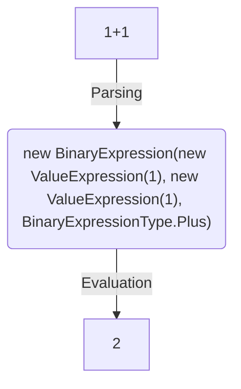

# Architecture

The entire process of evaluating an expression can be demonstrated at this flowchart:



## Parsing

Parsing is the process of analyzing the input expression and converting it into a structured format that can be easily
evaluated. We use [Parlot](https://github.com/sebastienros/parlot) to handle parsing, but you can use any parser you
want if you implement the interface <xref:NCalc.Factories.ILogicalExpressionFactory>.
For our example, "1+1", the parsing step converts the string into an abstract syntax tree (AST).
This tree is made up of different types of expressions, such as binary expressions, value expressions our even
functions.
Our AST is represented by <xref:NCalc.Domain.LogicalExpression> class.

## Evaluation

Evaluation refers to the process of determining the value of an expression. We use the visitor pattern at evaluation.
This pattern allows you to add new operations to existing object structures without modifying those structures.
With the method <xref:NCalc.Domain.LogicalExpression.Accept``1(NCalc.Visitors.ILogicalExpressionVisitor{``0})> is possible to accept any kind of visitor that
implements <xref:NCalc.Visitors.ILogicalExpressionVisitor`1>. Example implementations
include <xref:NCalc.Visitors.EvaluationVisitor> that returns a <xref:System.Object>
and <xref:NCalc.Visitors.SerializationVisitor> that converts the AST into a <xref:System.String>.

If you are creating your custom implementation, beware it should be stateless to be easier to debug and read. This is
enforced by the [PureAttribute](https://learn.microsoft.com/en-us/dotnet/api/system.diagnostics.contracts.pureattribute0) and generic return at
the <xref:NCalc.Domain.LogicalExpression.Accept``1(NCalc.Visitors.ILogicalExpressionVisitor{``0})> method.

## <xref:NCalc.Expression> Class

This is the main class of NCalc. It abstracts the process of parsing and evaluating the string.
The method <xref:NCalc.Expression.Evaluate> returns the actual value of its <xref:System.String> representation.

Example:

```c#
var expression = new Expression("2 * 3");
var result = expression.Evaluate();
  
Console.WriteLine(result);
```

This example above first creates an instance of <xref:NCalc.Expression> using a valued constructor. This constructor
takes a <xref:System.String> as parameter.
Then the method <xref:NCalc.Expression.Evaluate> is called to parse the <xref:System.String> and returns the actual
value represented by the <xref:System.String>.

To create expressions you can combine several [Operators](operators.md) and [Values](values.md).

Multiple expressions can be combined into a sequence by joning them with a ";" (semicolon) character. 
Such an expression sequence returns the value of its latest expression as a value.
Expression sequences may be useful to [assign and update parameters](parameters.md) and then perform a calculation using these updated parameters. 
Support for expression sequences must be enabled by including the `UseStatementSequences` flag into <xref:NCalc.ExpressionOptions> of an <xref:NCalc.Expression>.

## Learn More
For additional information on the technique we used to create this library please read [this
article](http://www.codeproject.com/KB/recipes/sota_expression_evaluator.aspx).
